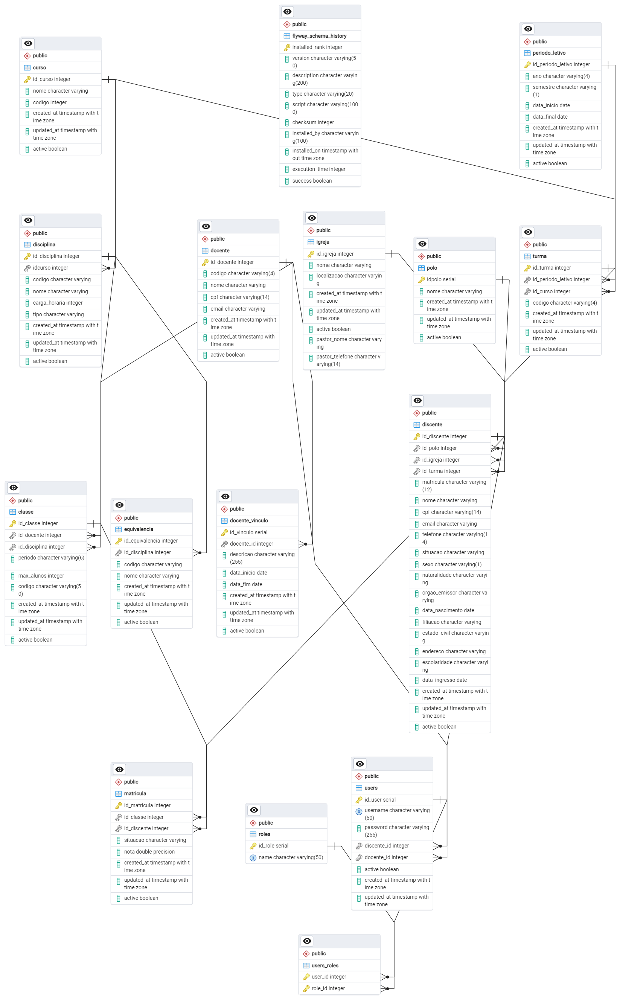

# 🚀 AVA Genius

## 📌 Tecnologias Utilizadas

### **Frontend**
- Angular 19
- Angular CLI
- Node.js 22
- Tailwind CSS 4
- Angular Material 19

### **Backend**
- Java 17
- Spring Boot
- Flyway (Versionamento do banco de dados)
- PostgreSQL

## 🛠️ Configuração do Ambiente

### **Pré-requisitos**
Certifique-se de ter instalado:
- **Node.js 22** e **Angular CLI** para rodar o frontend.
- **Java 17** e **PostgreSQL** para rodar o backend.

### **Banco de Dados**
#### **Criando via linha de comando**
1. Criar um superusuário no PostgreSQL:
   ```sql
   CREATE USER genius-dev WITH SUPERUSER PASSWORD 'genius';
   ```
2. Criar o banco de dados e definir o owner:
   ```sql
   CREATE DATABASE genius OWNER genius-dev;
   ```

#### **Criando via interface gráfica (pgAdmin)**
1. Acesse o **pgAdmin** e conecte-se ao seu servidor PostgreSQL.
2. No painel esquerdo, clique com o botão direito em "Login/Group Roles" e selecione "Create" → "Login/Group Role".
3. No campo "Name", digite **genius-dev** e na aba "Definition", defina a senha como **genius**.
4. Vá para a aba "Privileges" e marque "Superuser" como **true**.
5. Clique em **Save** para criar o usuário.
6. Agora, clique com o botão direito em "Databases" e selecione "Create" → "Database".
7. No campo "Database", digite **genius** e em "Owner", selecione **genius-dev**.
8. Clique em **Save** para finalizar.

## ▶️ Como Rodar o Projeto

### **Rodando o Frontend**
```sh
cd frontend
npm install  # Instalar dependências
ng serve     # Iniciar o servidor Angular
```

### **Rodando o Backend**
#### **Via linha de comando**
```sh
cd backend
./mvnw spring-boot:run  # Iniciar a aplicação Spring Boot
```

#### **Via IDE (IntelliJ / Eclipse / VS Code)**
1. Abra o projeto backend na sua IDE preferida.
2. Localize a classe principal da aplicação (geralmente **Application.java** ou similar).
3. Clique com o botão direito sobre a classe e selecione "Run" para iniciar a aplicação.

## 🛠️ Futuras Melhorias
- Dockerizar a aplicação para facilitar a configuração do ambiente.

## 🗄️ Modelo de dados
- 